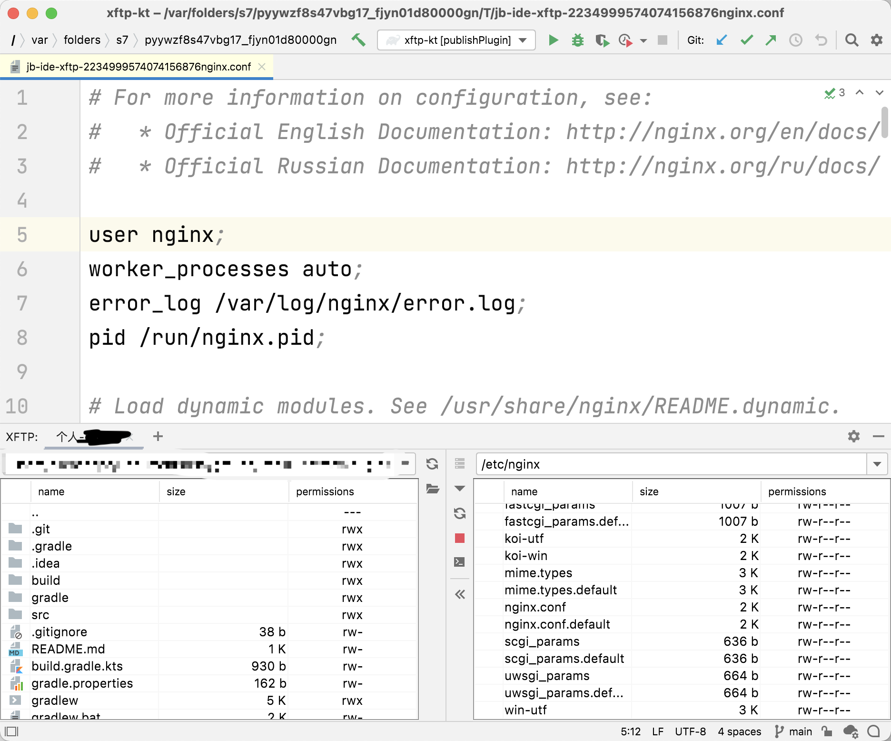

# XFTP - A SFTP tools for IntelliJ IDEA Ultimate

### [GitHub](https://github.com/ALLAPE/Java-IDEAPlugin-XFTP) | [JetBrains Marketplace](https://plugins.jetbrains.com/plugin/16590-xftp)

### Screen Shots


### Features
- ✔️ Editing remote files just by double-click it, and saving (Ctrl s or Cmd s by default) for uploading.
- ✔️ Drop on remote view port to upload (just available for dragging from Finder or Explorer).
- ✔️️ Dragging from local file view port to remote file view port, and vice versa.
- ✔️️ Open new terminal session in current folder.
- ✔️️️ Autocomplete for history paths.
- ✖️ Transferring history list with re-try button.
- ✖️ sftp FileSystem with custom VirtualFile.
- ➖️ More operations in file view port: delete, copy, paste, etc...

## Known Issues
- Make sure the double-clicked remote file is not in the downloading queue.
- Folder uploading progress(Task.Backgroundable) calculation error.

### Nuts-pain
```java
ConnectionBuilder connectionBuilder = RemoteCredentialsUtil.connectionBuilder(data, this.project);
SftpChannel sftpChannel = connectionBuilder.openSftpChannel();
sftpChannel.uploadFileOrDir(local, remote, ""); // -> throws some exceptions because the remote variable has been appended a "/" at its tail
```

### Enhancements
- UI needs obey [IntelliJ Platform UI Guidelines](https://jetbrains.github.io/ui/)
- Uploading and downloading performance test.
- English JavaDoc and comments maybe?
- More comfortable usage of SSHChannel?
